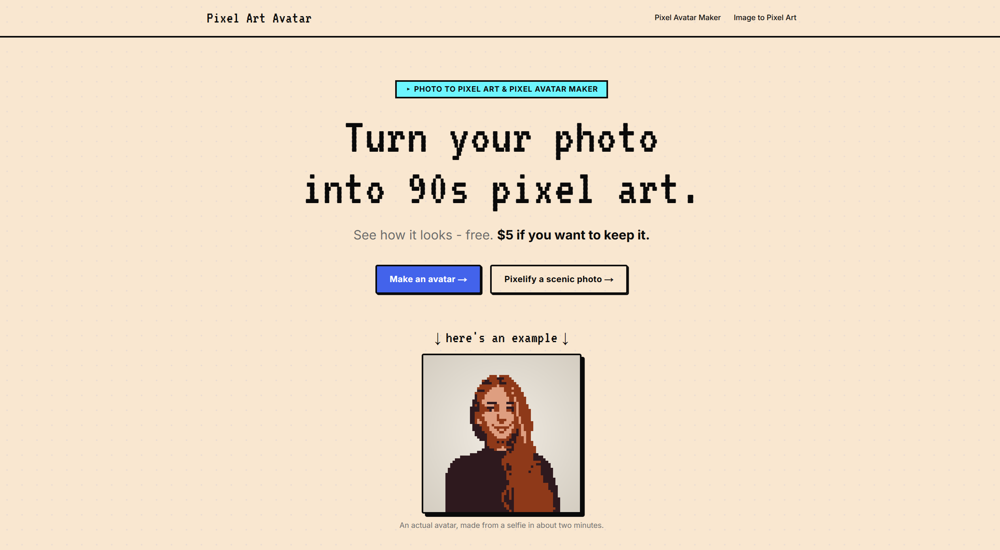

# Pixel Art Avatar



> Turn your photo into 90s pixel art. See how it looks - free.
>
> Live at **pixelartavatar.com**

A Next.js (App Router) app that turns photos into chunky 90s-style pixel art via Replicate's `retro-diffusion/rd-fast` model. Free watermarked previews; pay $5 to download the clean PNG.

## Setup

```bash
npm install
cp .env.local.example .env.local   # then fill in your own values
npm run dev
```

Open http://localhost:3000. Without any env vars set the app runs in "dev fallback" mode: it returns the source image as the preview so the UI flow is usable without burning API credits.

### Env vars

All keys live in `.env.local`. See [.env.local.example](./.env.local.example) for the full list. Grouped by purpose:

- **Replicate** (`REPLICATE_API_TOKEN`) — runs the rd-fast pixel-art model, BRIA background removal, and LLaVA face analysis.
- **Stripe** (`STRIPE_SECRET_KEY`, `STRIPE_WEBHOOK_SECRET`) — checkout and the payment-completed webhook.
- **Cloudflare R2** (`R2_ACCOUNT_ID`, `R2_ACCESS_KEY_ID`, `R2_SECRET_ACCESS_KEY`, `R2_BUCKET_NAME`) — temporary storage for clean PNGs (1-day auto-delete).
- **Cloudflare Turnstile** (`NEXT_PUBLIC_TURNSTILE_SITE_KEY`, `TURNSTILE_SECRET_KEY`) — bot check on free preview generation.
- **Upstash Redis** (`UPSTASH_REDIS_REST_URL`, `UPSTASH_REDIS_REST_TOKEN`) — IP-based rate limiting.
- **Resend** (`RESEND_API_KEY`, `RESEND_FROM_EMAIL`, `CONTACT_TO_EMAIL`) — contact-form email delivery.
- **Owner bypass** (`OWNER_BYPASS_TOKEN`) — bypass the rate limit for testing via `/api/owner?token=...`.

Each subsystem is independent: if a key is missing it no-ops (e.g. no Replicate token returns the source image; no Stripe key fakes the checkout redirect). You can wire them up one at a time.

## What's in here

- Landing at `/` with hero, FAQ, and JSON-LD structured data (WebApplication + FAQPage).
- `/avatar` and `/photo-to-pixel-art` tool pages (drop-zone upload, free preview, paid download).
- SEO long-tail pages: `/pixel-avatar-for-discord`, `/twitch-pixel-avatar-maker`, `/8-bit-profile-picture-maker`.
- `/terms`, `/privacy`, `/contact` (noindex, with a self-hosted anti-bot contact form).
- API routes: `/api/generate`, `/api/checkout`, `/api/webhook`, `/api/contact`, `/api/owner`.
- Server-side watermarking via a hand-rolled bitmap font (no system-font dependency, works on Vercel).

## Design system

- Cream base `#f4f1e8`, bold blue accent `#2563eb`, cyan accent `#00f5ff`, black ink `#0a0a0a`
- VT323 (pixel font) for headers, Inter for body
- Chunky buttons with a hard 4px drop shadow and press-down on click

## Deploy

Push to GitHub. Connect the repo to Vercel. Set the env vars from `.env.local` in the Vercel dashboard. Done.

## License

[MIT](./LICENSE).
